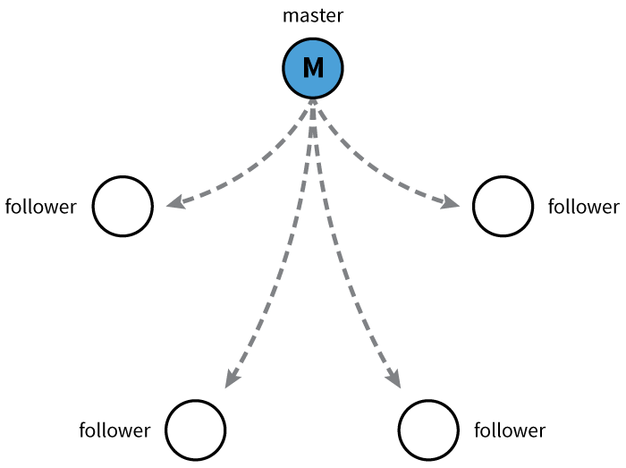
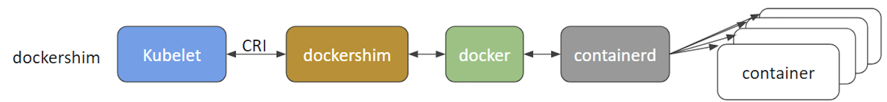
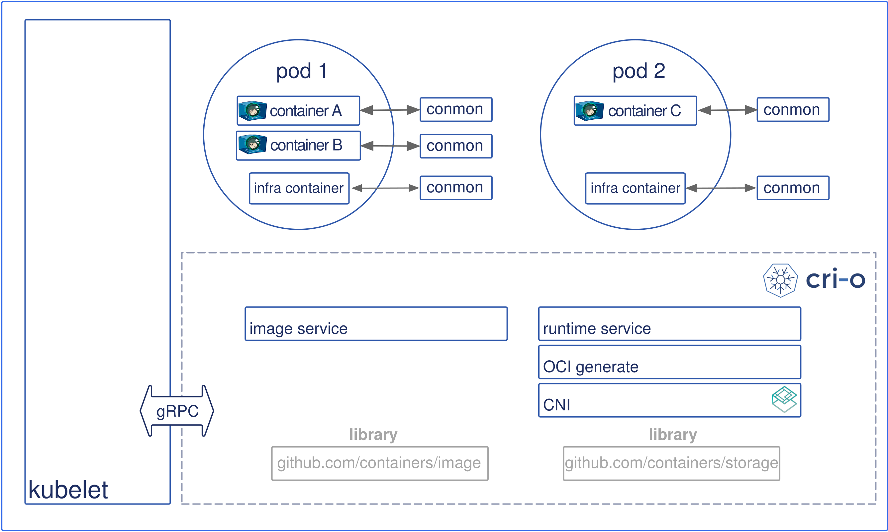
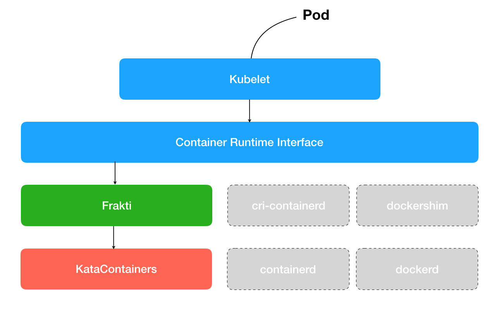

# **Kubernetes Architecture**

At a very high level, Kubernetes has the following main components:

- One or more **master nodes**, part of the **control plane** 
- One or more **worker nodes**.

**Components of K8s Architecture**

## **Master Node Overview**

The master node provides a running environment for the control plane responsible for managing the state of a Kubernetes cluster, and it is the brain behind all operations inside the cluster. The control plane components are agents with very distinct roles in the cluster's management. In order to communicate with the Kubernetes cluster, users send requests to the control plane via a Command Line Interface (CLI) tool, a Web User-Interface (Web UI) Dashboard, or Application Programming Interface (API).

It is important to keep the control plane running at all costs. Losing the control plane may introduce downtime, causing service disruption to clients, with possible loss of business. To ensure the control plane's fault tolerance, master node replicas can be added to the cluster, configured in High-Availability (HA) mode. While only one of the master nodes is dedicated to actively manage the cluster, the control plane components stay in sync across the master node replicas. This type of configuration adds resiliency to the cluster's control plane, should the active master node fail.

To persist the Kubernetes cluster's state, all cluster configuration data is saved to etcd. etcd is a distributed key-value store which only holds cluster state related data, no client workload data. etcd may be configured on the master node (stacked topology), or on its dedicated host (external topology) to help reduce the chances of data store loss by decoupling it from the other control plane agents.

With stacked etcd topology, HA master node replicas ensure the etcd data store's resiliency as well. However, that is not the case with external etcd topology, where the etcd hosts have to be separately replicated for HA, a configuration that introduces the need for additional hardware.

## **Master Node Components**

A master node runs the following control plane components:

- API Server
- Scheduler
- Controller Managers
- Data Store

In addition, the master node run:

- Container Runtime
- Node agent
- Proxy

### -  **API Server**

All the administrative tasks are coordinated by the kube-apiserver, a central control plane component running on the master node. The **API Server** intercepts RESTful calls from users, operators and external agents, then validates and processes them. During processing the **API Server** reads the Kubernetes cluster's current state from the etcd data store, and after a call's execution, the resulting state of the Kubernetes cluster is saved in the distributed key-value data store for persistence. The API Server is the only master plane component to talk to the etcd data store, both to read from and to save Kubernetes cluster state information - acting as a middle interface for any other control plane agent inquiring about the cluster's state.

The **API Server** is highly configurable and customizable. It can scale horizontally, but it also supports the addition of custom secondary **API Servers**, a configuration that transforms the primary API Server into a proxy to all secondary, custom API Servers and routes all incoming RESTful calls to them based on custom defined rules.

### - **Scheduler**

The role of the **kube-scheduler** is to assign new workload objects, such as pods, to nodes. During the scheduling process, decisions are made based on current Kubernetes cluster state and new object's requirements. The scheduler obtains from the etcd data store, via the API Server, resource usage data for each worker node in the cluster. The scheduler also receives from the API Server the new object's requirements which are part of its configuration data. Requirements may include constraints that users and operators set, such as scheduling work on a node labeled with disk==ssd key/value pair. The scheduler also takes into account Quality of Service (QoS) requirements, data locality, affinity, anti-affinity, taints, toleration, cluster topology, etc. Once all the cluster data is available, the scheduling algorithm filters the nodes with predicates to isolate the possible node candidates which then are scored with priorities in order to select the one node that satisfies all the requirements for hosting the new workload. The outcome of the decision process is communicated back to the API Server, which then delegates the workload deployment with other control plane agents. 

The scheduler is highly configurable and customizable through scheduling policies, plugins, and profiles. Additional custom schedulers are also supported, then the object's configuration data should include the name of the custom scheduler expected to make the scheduling decision for that particular object; if no such data is included, the default scheduler is selected instead.

A scheduler is extremely important and complex in a multi-node Kubernetes cluster. In a single-node Kubernetes cluster, such as the one explored later in this course, the scheduler's job is quite simple.

### - **Controller Managers**
The controller managers are control plane components on the master node running controllers to regulate the state of the Kubernetes cluster. Controllers are watch-loops continuously running and comparing the cluster's desired state (provided by objects' configuration data) with its current state (obtained from etcd data store via the API server). In case of a mismatch corrective action is taken in the cluster until its current state matches the desired state.

The kube-controller-manager runs controllers responsible to act when nodes become unavailable, to ensure pod counts are as expected, to create endpoints, service accounts, and API access tokens.

The cloud-controller-manager runs controllers responsible to interact with the underlying infrastructure of a cloud provider when nodes become unavailable, to manage storage volumes when provided by a cloud service, and to manage load balancing and routing.

### - **Data Store**

**etcd** is a strongly consistent, distributed key-value data store used to persist a Kubernetes cluster's state. New data is written to the data store only by appending to it, data is never replaced in the data store. Obsolete data is compacted periodically to minimize the size of the data store.

Out of all the control plane components, only the API Server is able to communicate with the **etcd** data store.

etcd's CLI management tool - **etcdctl**, provides backup, snapshot, and restore capabilities which come in handy especially for a single etcd instance Kubernetes cluster - common in Development and learning environments. However, in Stage and Production environments, it is extremely important to replicate the data stores in HA mode, for cluster configuration data resiliency.

Some Kubernetes cluster bootstrapping tools, such as kubeadm, by default, provision stacked etcd master nodes, where the data store runs alongside and shares resources with the other control plane components on the same master node.

**Stacked etcd topology**

For data store isolation from the control plane components, the bootstrapping process can be configured for an external etcd topology, where the data store is provisioned on a dedicated separate host, thus reducing the chances of an etcd failure.

  **External etcd topology**

Both stacked and external etcd configurations support HA configurations. etcd is based on the **Raft Consensus Algorithm** which allows a collection of machines to work as a coherent group that can survive the failures of some of its members. At any given time, one of the nodes in the group will be the master, and the rest of them will be the followers. etcd gracefully handles master elections and can tolerate node failure, including master node failures. Any node can be treated as a master. 

**Master and Followers**

etcd is written in the Go programming language. In Kubernetes, besides storing the cluster state, etcd is also used to store configuration details such as subnets, ConfigMaps, Secrets, etc.

### - **Worker Node Overview**

A **worker node** provides a running environment for client applications. Though containerized microservices, these applications are encapsulated in Pods, controlled by the cluster control plane agents running on the master node. Pods are scheduled on worker nodes, where they find required compute, memory and storage resources to run, and networking to talk to each other and the outside world. A Pod is the smallest scheduling unit in Kubernetes. It is a logical collection of one or more containers scheduled together, and the collection can be started, stopped, or rescheduled as a single unit of work. 

Also, in a multi-worker Kubernetes cluster, the network traffic between client users and the containerized applications deployed in Pods is handled directly by the worker nodes, and is not routed through the master node.

## **Worker Nodes Components**

A worker node has the following components:

- Container Runtime
- Node Agent - kubelet
- Proxy - kube-proxy
- Addons for DNS, Dashboard user interface, cluster-level monitoring and logging.

### - **Container Runtime**

Although Kubernetes is described as a "container orchestration engine", it does not have the capability to directly handle containers. In order to manage a container's lifecycle, Kubernetes requires a container runtime on the node where a Pod and its containers are to be scheduled. Kubernetes supports many container runtimes:

- Docker - although a container platform which uses **containerd** as a container runtime, it is the most popular container runtime used with Kubernetes

- CRI-O - a lightweight container runtime for Kubernetes, it also supports Docker image registries

- containerd - a simple and portable container runtime providing robustness

- frakti - a hypervisor-based container runtime for Kubernetes

### - **Node Agent - kubelet**

The **kubelet** is an agent running on each node and communicates with the control plane components from the master node. It receives Pod definitions, primarily from the API Server, and interacts with the container runtime on the node to run containers associated with the Pod. It also monitors the health and resources of Pods running containers.

The **kubelet** connects to container runtimes though a plugin based interface - the Container Runtime Interface (CRI). The CRI consists of protocol buffers, gRPC API, libraries, and additional specifications and tools that are currently under development. In order to connect to interchangeable container runtimes, kubelet uses a **shim** application which provides a clear abstraction layer between kubelet and the container runtime.

**Container Runtime Interface**

(Retrieved from blog.kubernetes.io)

As shown above, the **kubelet** acting as grpc client connects to the CRI shim acting as grpc server to perform container and image operations. The CRI implements two services: ImageService and RuntimeService. The ImageService is responsible for all the image-related operations, while the RuntimeService is responsible for all the Pod and container-related operations.

Container runtimes used to be hard-coded into kubelet, but since the CRI was introduced, Kubernetes has become more flexible to use different container runtimes without the need to recompile. Any container runtime that implements the CRI can be used by Kubernetes to manage Pods, containers, and container images.

### - **kubelet - CRI shims**
Shims are CRI implementations, or interfaces, specific to each container runtime supported by Kubernetes. Below we present some examples of CRI shims:

- **dockershim**:
With dockershim, containers are created using Docker installed on the worker nodes. Internally, Docker uses containerd to create and manage containers:

**dockershim**

(Retrieved from blog.kubernetes.io) 

- **cri-containerd**:
With cri-containerd, we can directly use containerd to create and manage containers:

**cri-containerd**

(Retrieved from blog.kubernetes.io) 

- **CRI-O**:
CRI-O enables the use if any Open Container Initiative (OCI) compatible runtime with Kubernetes. At the time this course was created, CRI-O supported runC and Clear Containers as container runtimes. However, in principle, any OCI-compliant runtime can be plugged-in.

**CRI-O**

(Retrieved from cri-o.io) 

- **frakti**:
frakti enables CRI implementation through hardware virtualization, aimed to achieve a higher level of security and isolation than the traditional Linux OS level containers based on cgroups and namespaces. The frakti CRI shim is aimed at enabling kubelet to interact with Kata Containers:

**frakti**

(Retrieved from github.com/kubernetes/frakti) 

### - **Proxy - kube-proxy**

The **kube-proxy** is the network agent which runs on each node responsible for dynamic updates and maintenance of all networking rules on the node. It abstracts the details of Pods networking and forwards connection requests to Pods. 

The kube-proxy is responsible for TCP, UDP, and SCTP stream forwarding or round-robin forwarding across a set of Pod backends, and it implements forwarding rules defined by users through Service API objects.

### - **Addons**

**Addons** are cluster features and functionality not yet available in Kubernetes, therefore implemented through 3rd-party pods and services.

- **DNS** - cluster DNS is a DNS server required to assign DNS records to Kubernetes objects and resources
- **Dashboard** - a general purposed web-based user interface for cluster management
- **Monitoring** - collects cluster-level container metrics and saves them to a central data store
- **Logging** - collects cluster-level container logs and saves them to a central log store for analysis.